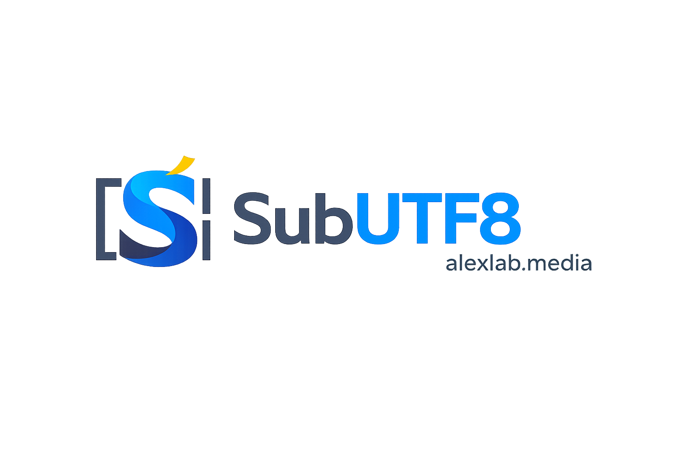

<div align="center">
  

# SubUTF8

**Convert subtitle files to UTF-8, repair broken Romanian characters, and resync subtitle timing locally on your device.**

[](https://srt.alexlab.media)
[](https://srt.alexlab.media)
[](https://react.dev/)
[](https://www.typescriptlang.org/)
[](LICENSE)

**[Open SubUTF8](https://srt.alexlab.media)**
</div>

---

## What is SubUTF8?

SubUTF8 is a lightweight, mobile-first subtitle utility built for quick use on iPhone, Android, tablet and desktop.

It provides two local tools:

- **UTF-8 conversion** for subtitle text files that use legacy encodings or contain incorrectly displayed Romanian characters;
- **subtitle resync** for moving every supported timing cue earlier or later by a millisecond offset.

All processing happens locally in the browser. Subtitle contents are not uploaded to an alexlab.media server.

## Features

- Multi-file import and batch processing
- Automatic encoding detection for common subtitle encodings
- UTF-8 conversion while preserving subtitle structure and timestamps
- Automatic repair for incorrectly displayed Romanian characters
- Legacy Romanian `ş` / `ţ` normalization to `ș` / `ț`
- Optional automatic conversion immediately after file selection
- Subtitle resync with positive or negative millisecond offsets
- Quick resync controls for ±100, ±500 and ±1000 ms
- SRT and WebVTT millisecond timing support
- ASS / SSA timing support
- SMI timing support
- Text `.sub` resync for MicroDVD and SubViewer formats
- MicroDVD FPS handling, including embedded FPS metadata when present
- Individual file download
- Batch ZIP export with duplicate filename protection
- Original filenames are preserved
- Local, browser-side processing
- Installable PWA for an app-like experience
- Capacitor-ready project structure for native iOS packaging
- Responsive interface for phone, tablet and desktop

## Supported text subtitle formats

| Format | UTF-8 conversion | Resync |
| --- | --- | --- |
| `.srt` | ✅ | ✅ |
| `.sub` (text-based) | ✅ | ✅ MicroDVD / SubViewer |
| `.ass` | ✅ | ✅ |
| `.ssa` | ✅ | ✅ |
| `.vtt` | ✅ | ✅ |
| `.smi` | ✅ | ✅ |
| `.txt` | ✅ | — |

### Image-based subtitles

`.sub/.idx` (VobSub) and `.sup` / PGS subtitles are image-based formats and require OCR. They are intentionally outside the scope of SubUTF8. The app rejects subtitle data that appears to be binary instead of text.

## Subtitle resync

The **Resync** tab applies one offset to every timing cue in the selected subtitle files.

Examples:

```text
+1000 ms = subtitles appear 1 second later
-1000 ms = subtitles appear 1 second earlier
+2500 ms = subtitles appear 2.5 seconds later
-350 ms  = subtitles appear 0.35 seconds earlier
```

**1 second = 1000 milliseconds.**

SRT and VTT preserve millisecond precision. ASS/SSA and some text `.sub` variants use coarser timing precision. MicroDVD `.sub` files are frame-based, so SubUTF8 converts the millisecond offset to frames using the embedded FPS value when available or the FPS selected by the user. Timing values that would become negative are clamped to zero.

## Encoding support

SubUTF8 handles or detects common subtitle encodings including:

- UTF-8
- UTF-8 with BOM
- UTF-16 LE
- UTF-16 BE
- BOM-less UTF-16 LE / BE when the byte pattern can be identified reliably
- Windows-1250
- Windows-1252
- ISO-8859-2

The converter then outputs UTF-8 encoded text.

## Romanian character repair

The conversion pass fixes common incorrectly displayed Romanian text, including mappings such as:

```text
ÅŸ → ș
Å£ → ț
Åž → Ș
Å¢ → Ț
ş  → ș
ţ  → ț
```

The feature is intended to repair text encoding artifacts only. It does not rewrite subtitle dialogue or timing.

## Privacy

SubUTF8 was designed around local processing:

- files are read directly by the browser;
- subtitle contents are processed on the user's device;
- converted and resynced files are generated locally;
- no account is required;
- no subtitle upload API is required.

The public deployment is hosted at **[srt.alexlab.media](https://srt.alexlab.media)**.

## Install as an app

SubUTF8 is a Progressive Web App.

### iPhone / iPad

1. Open `srt.alexlab.media` in Safari.
2. Tap **Share**.
3. Choose **Add to Home Screen**.
4. Enable **Open as Web App** when the option is available.

### Other supported browsers

Use the browser's **Install app** / **Add to Home Screen** option when offered.

## Run locally

Requirements:

- Node.js
- npm

```bash
npm install
npm run dev
```

Vite will start the local development server.

## Production build

```bash
npm install
npm run build
```

The production output is generated in `dist/`.

## Native iOS project with Capacitor

A native iOS wrapper can be generated on macOS with Xcode:

```bash
npm install
npm run build
npx cap add ios
npx cap sync ios
npx cap open ios
```

Then select an Apple Development Team in Xcode and configure signing as needed.

## Technology

- React 19
- TypeScript
- Vite
- Capacitor
- browser-native `TextDecoder` / `TextEncoder` for subtitle text decoding and UTF-8 output
- `fflate` for ZIP generation
- Cloudflare Pages for the public web deployment

## Security

SubUTF8 does not render uploaded subtitle text as HTML and does not send subtitle contents to a remote API. ZIP filenames are sanitized before archive creation, binary-looking subtitle files are rejected, and very large inputs are limited to reduce accidental browser resource exhaustion.

Please see [SECURITY.md](SECURITY.md) for responsible vulnerability reporting.

Do not publish security-sensitive exploit details in a public issue.

## Support the project

If SubUTF8 is useful to you and you would like to support its continued development, you can optionally buy me a beer through PayPal:

**🍺 [Support SubUTF8 via PayPal](https://www.paypal.me/AlexandruCiobanu00)**

Support is entirely optional and does not unlock features.

## License

SubUTF8 is **source-available but proprietary software**.

Copyright © 2026 Zuzuitu / alexlab.media. All rights reserved.

The repository is public for transparency, inspection and project visibility. Public availability of the source code does **not** grant permission to copy, modify, redistribute, rebrand, publish, sell, sublicense, host or incorporate SubUTF8 or substantial portions of its code into another project without prior written permission from the copyright holder.

See [LICENSE](LICENSE) for the complete terms.